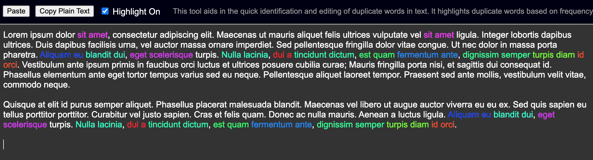

# Duplicate word highlighter
Standalone HTML page to help quickly identify and remove duplicate runs of text. Paste as plain unformatted text -- it isn't intended to edit *rich* styled text text or HTML. It uses a double-frame to bypass the whole buggy issue with HTML `contenteditable="true"` in most browsers at present (2024).

## Screenshot:

[**Live version**](https://akingdom.github.io/duplicate_word_highlighter/duplicate_word_highlighter.html)
